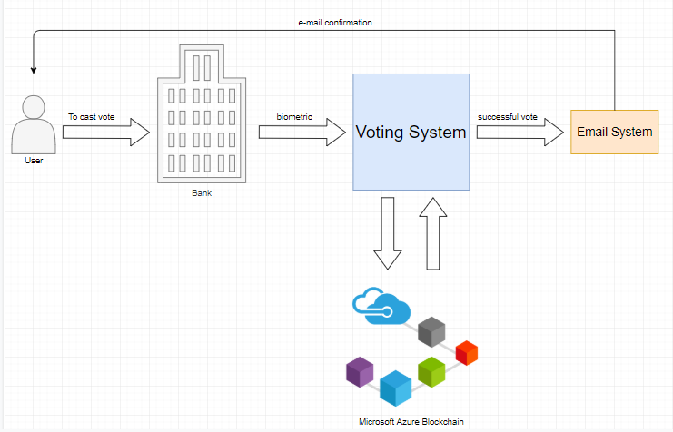
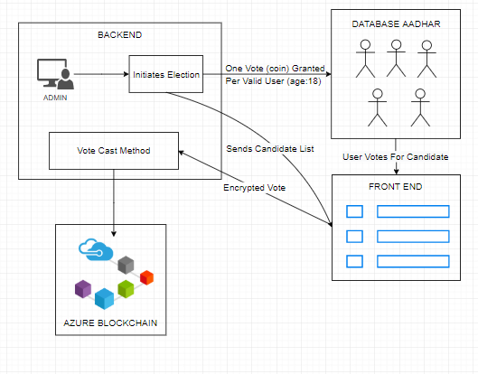

# decentralized-voting

A decentralized voting system where a user can walk into a government authorized center (Ex- banks, telecom compnies ect.) and cast their vote using the proposed portal.

### Key Advantages

 - Secure vote by Azure blockchain and biometric authentication (using pre-existing Aadhar database)
 - Reduced cost during election process
 - Shorter wait times as it is decentralized
 - A vote can be cast from anywhere in the country

### A Vote's Story

A user will walk into a government authorized center and complete his/her biometric verification. Once the verification is complete the user will be taken to a web-based portal **(developed by us)** where he/she will be presented with the voting options. The portal then sends the infomation of the user's vote (encrypted) to azure blockchain service where the data will be decrypted and the vote's transaction from the user to the party will take place. The party with the most votes is elected. During each election time the users are granted one vote which will make sure only one transation can be made by the user during the whole election process.

###  Workflow Diagram

### Voting System Workflow

### Technologies

 - Azure Blockchain
 - Docker (deployment of portal)
 - Flask (web framework)
 - Python 

